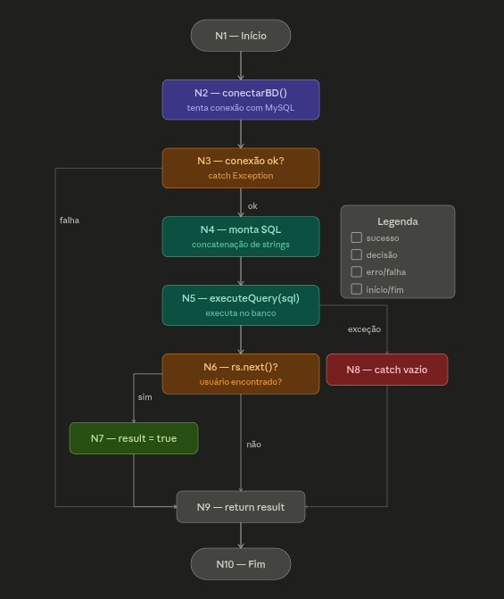

# Teste de Caixa Branca — Análise e Revisão de Código Java

## 1. Introdução

Esta atividade tem como objetivo analisar estruturalmente um código Java de autenticação utilizando os conceitos de Teste de Caixa Branca. O código analisado representa uma implementação de autenticação com banco de dados MySQL, composta pela classe `User` com dois métodos: `conectarBD()` e `verificarUsuario()`.

A análise abrange revisão estática do código, modelagem do fluxo de execução, cálculo da complexidade ciclomática, identificação dos caminhos básicos e correção das falhas encontradas.

---

## 2. Análise Estática do Código

### Código original analisado

```java
package login;

import java.sql.Connection;
import java.sql.DriverManager;
import java.sql.ResultSet;
import java.sql.Statement;

public class User {
    public Connection conectarBD() {
        Connection conn = null;
        try {
            Class.forName("com.mysql.Driver.Manager").newInstance();
            String url = "jdbc:mysql://127.0.0.1/test?user=lopes&password=123";
            conn = DriverManager.getConnection(url);
        } catch (Exception e) { }
        return conn;
    }

    public String nome = "";
    public boolean result = false;

    public boolean verificarUsuario(String login, String senha) {
        String sql = "";
        Connection conn = conectarBD();
        // INSTRUÇÃO SQL
        sql += "select nome from usuarios ";
        sql += "where login = " + "'" + login + "'";
        sql += " and senha = " + "'" + senha + "';";
        try {
            Statement st = conn.createStatement();
            ResultSet rs = st.executeQuery(sql);
            if (rs.next()) {
                result = true;
                nome = rs.getString("nome");
            }
        } catch (Exception e) { }
        return result;
    }
} // fim da class
```

### Documentação

O código possui documentação inadequada. O único comentário presente (`// INSTRUÇÃO SQL`) é genérico e não agrega valor técnico. Não há Javadoc nos métodos, ausência de descrição de parâmetros, retornos e exceções esperadas.

### Nomenclatura de variáveis e métodos

A nomenclatura é parcialmente adequada. Os nomes `conectarBD`, `verificarUsuario`, `login` e `senha` são descritivos. Porém, `result` é uma variável de instância usada como estado mutável dentro de um método, o que é uma má prática — deveria ser uma variável local.

### Organização e legibilidade

O código apresenta problemas de organização. As variáveis de instância `nome` e `result` são declaradas entre os dois métodos, dificultando a leitura. O método `verificarUsuario` acumula muitas responsabilidades (conectar, montar SQL, executar e retornar resultado).

### Riscos de NullPointerException

**CRÍTICO**: Se `conectarBD()` falhar (o que pode ocorrer silenciosamente pois o catch está vazio), o método retorna `null`. Na linha seguinte, `conn.createStatement()` lançará `NullPointerException` em tempo de execução sem nenhum tratamento adequado.

### Fechamento de conexões e recursos

**GRAVE**: `Connection`, `Statement` e `ResultSet` não são fechados em nenhum momento. Isso gera vazamento de recursos (resource leak), podendo esgotar o pool de conexões do banco de dados em produção.

### Vulnerabilidades de segurança

**CRÍTICO — SQL Injection**: A construção da query por concatenação de strings permite que um atacante injete comandos SQL. Exemplo: passando `login = ' OR '1'='1`, a query se torna verdadeira para qualquer senha, permitindo acesso sem autenticação.

```sql
-- Query original vulnerável:
select nome from usuarios where login = '' OR '1'='1' and senha = 'qualquer';
```

**CRÍTICO — Credenciais expostas**: A URL de conexão `jdbc:mysql://127.0.0.1/test?user=lopes&password=123` contém usuário e senha em texto puro no código-fonte.

**CRÍTICO — Nome do driver incorreto**: `com.mysql.Driver.Manager` não é o nome correto do driver MySQL. O correto é `com.mysql.cj.jdbc.Driver`.

### Tratamento de exceções

O tratamento de exceções é completamente inadequado. Ambos os blocos `catch` estão vazios — as exceções são capturadas e silenciadas sem log, sem relançamento e sem nenhuma ação corretiva. Isso torna impossível diagnosticar falhas em produção.

### Más práticas identificadas

- `result` é atributo de instância, tornando o objeto não thread-safe
- Concatenação de strings para SQL ao invés de `PreparedStatement`
- Ausência de `finally` ou try-with-resources para fechar recursos
- Driver registrado com `newInstance()` (método obsoleto desde Java 9)
- Senha armazenada em texto plano no banco de dados (presumível)

---

## 3. Grafo de Fluxo

O grafo de fluxo foi construído com base no método `verificarUsuario()`, que representa o fluxo principal da autenticação.



### Nós identificados

| Nó | Descrição |
|---|---|
| N1 | Início do método |
| N2 | Chamada a `conectarBD()` |
| N3 | Decisão: conexão bem-sucedida? |
| N4 | Montagem da query SQL |
| N5 | Execução da query (`executeQuery`) |
| N6 | Decisão: `rs.next()` — usuário encontrado? |
| N7 | `result = true` (login bem-sucedido) |
| N8 | `catch` de exceção (bloco vazio) |
| N9 | `return result` |
| N10 | Fim |

### Arestas identificadas

| Aresta | De | Para | Condição |
|---|---|---|---|
| E1 | N1 | N2 | — |
| E2 | N2 | N3 | — |
| E3 | N3 | N4 | conexão ok |
| E4 | N3 | N9 | falha na conexão |
| E5 | N4 | N5 | — |
| E6 | N5 | N6 | query executada |
| E7 | N5 | N8 | exceção |
| E8 | N6 | N7 | usuário encontrado (true) |
| E9 | N6 | N9 | usuário não encontrado (false) |
| E10 | N7 | N9 | — |
| E11 | N8 | N9 | — |
| E12 | N9 | N10 | — |

---

## 4. Complexidade Ciclomática

A fórmula utilizada é:

```
V(G) = E - N + 2P
```

Onde:
- **E** = número de arestas = **12**
- **N** = número de nós = **10**
- **P** = número de componentes conectados = **1**

### Cálculo

```
V(G) = 12 - 10 + 2(1)
V(G) = 12 - 10 + 2
V(G) = 4
```

**Complexidade Ciclomática: 4**

Isso significa que existem **4 caminhos independentes** no código, e são necessários no mínimo **4 casos de teste** para cobrir todas as estruturas do método.

---

## 5. Caminhos Básicos

### Caminho 1 — Falha na conexão com o banco

```
N1 → N2 → N3 → N9 → N10
```

**Descrição**: O método `conectarBD()` falha silenciosamente (catch vazio). A conexão retorna `null`. O método retorna `false` sem executar a query.

**Caso de teste**: banco de dados indisponível ou credenciais incorretas na URL.

---

### Caminho 2 — Login bem-sucedido

```
N1 → N2 → N3 → N4 → N5 → N6 → N7 → N9 → N10
```

**Descrição**: Conexão estabelecida com sucesso. Query montada e executada. `rs.next()` retorna `true` — usuário encontrado. `result = true`. Método retorna `true`.

**Caso de teste**: login `"admin"` e senha `"123"` cadastrados no banco.

---

### Caminho 3 — Usuário não encontrado

```
N1 → N2 → N3 → N4 → N5 → N6 → N9 → N10
```

**Descrição**: Conexão ok. Query executada. `rs.next()` retorna `false` — usuário não encontrado. Método retorna `false`.

**Caso de teste**: login ou senha incorretos.

---

### Caminho 4 — Exceção durante a query

```
N1 → N2 → N3 → N4 → N5 → N8 → N9 → N10
```

**Descrição**: Conexão ok. Query executada, mas ocorre uma exceção (ex: `NullPointerException` se `conn` for `null`). O catch vazio silencia o erro. Método retorna `false`.

**Caso de teste**: conexão retorna `null` + query tenta usar `conn.createStatement()`.

---

## 6. Melhorias Implementadas

O código revisado (`UserRefatorado.java`) corrige todos os problemas identificados:

- **SQL Injection eliminado**: uso de `PreparedStatement` com parâmetros (`?`) ao invés de concatenação
- **NullPointerException tratado**: verificação de `conn != null` antes de usar a conexão
- **Recursos fechados corretamente**: uso de try-with-resources (Java 7+) garantindo fechamento automático
- **Credenciais externalizadas**: uso de constantes separadas (idealmente viriam de variáveis de ambiente)
- **Exceptions logadas**: uso de `e.printStackTrace()` para rastreabilidade
- **Driver corrigido**: `com.mysql.cj.jdbc.Driver`
- **result como variável local**: removida a dependência do estado do objeto
- **Javadoc adicionado**: documentação técnica dos métodos

---

## 7. Conclusão

### Importância do teste estrutural

O teste de caixa branca permite identificar falhas que testes funcionais não conseguem detectar, como exceções silenciadas, recursos não fechados e vulnerabilidades de injeção de código. Ao analisar o fluxo interno do programa, é possível garantir cobertura de todos os caminhos críticos.

### Dificuldades encontradas

A principal dificuldade foi mapear todos os caminhos de exceção implícitos no código, especialmente o fato de que `conectarBD()` pode retornar `null` silenciosamente, criando um caminho de falha invisível ao desenvolvedor.

### Impacto da revisão de código

A revisão identificou 6 problemas críticos no código original, incluindo vulnerabilidade de SQL Injection que permitiria acesso não autorizado ao sistema. Em um ambiente de produção, esses problemas poderiam resultar em comprometimento total do banco de dados.

### Importância da qualidade de software

A atividade demonstra que mesmo um código aparentemente simples pode conter múltiplas falhas críticas. Práticas como revisão de código, análise estática automatizada (SonarQube, SpotBugs) e testes estruturais são essenciais para garantir a segurança e confiabilidade de sistemas de software.
